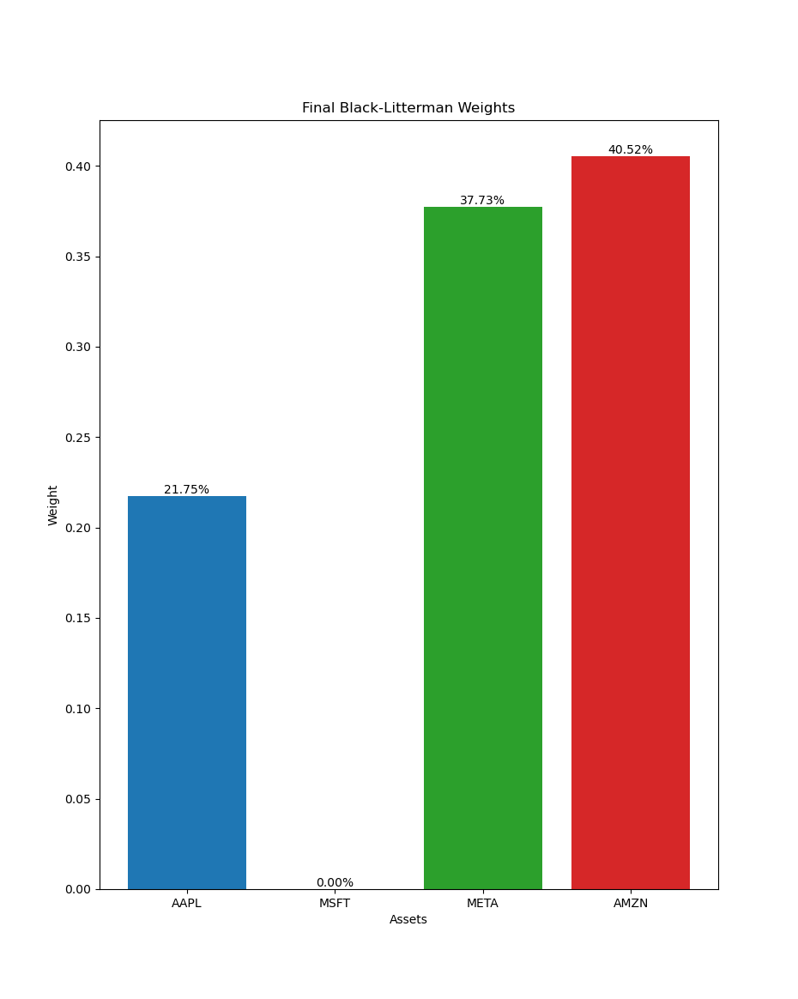
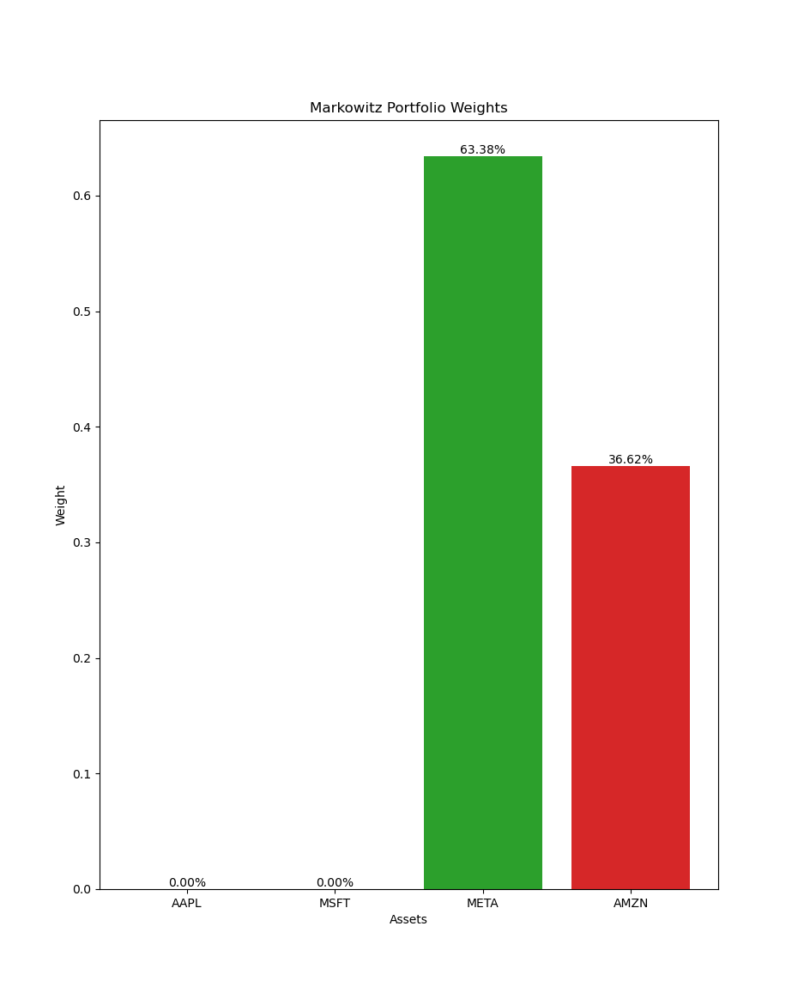
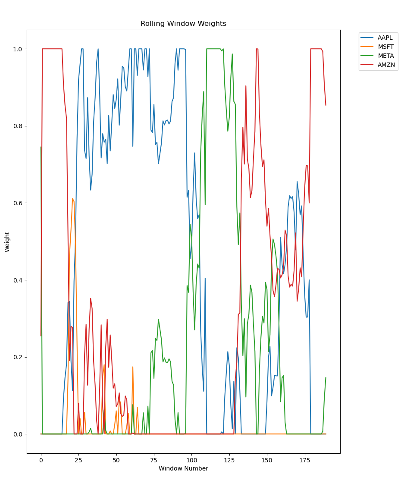

# Colin White - AI HW1
January 28, 2025

## Executive Summary
This report presents a comparative analysis between the Black-Litterman Model (BLM) and traditional Markowitz mean-variance optimization approach for a portfolio of four major technology stocks: Apple (AAPL), Microsoft (MSFT), Meta (META), and Amazon (AMZN). The analysis reveals how incorporating potentially incorrect views in the BLM can lead to suboptimal portfolio performance compared to the traditional mean-variance approach.

## Methodology

### Traditional Mean-Variance (Markowitz) Approach
The Markowitz portfolio optimization:
- Maximizes expected return for a given level of risk
- Uses historical data to estimate means and covariances
- Makes no assumptions about future relative performance
- Relies purely on statistical relationships between assets

### Black-Litterman Model Implementation
Our BLM implementation incorporated:
1. A relative view that AAPL would outperform MSFT: [1, -1, 0, 0]
2. Absolute views on individual assets
3. Confidence levels derived from historical covariances

## Results

*Figure 1: Optimal portfolio weights derived from the Black-Litterman model*

*Figure 2: Optimal portfolio weights from the traditional Markowitz mean-variance approach*

*Figure 3: Evolution of Black-Litterman portfolio weights over rolling windows*

### Portfolio Allocations

#### Black-Litterman Portfolio
- AMZN: 40.33%
- META: 37.79%
- AAPL: 21.88%
- MSFT: 0.00%

Performance Metrics:
- Sharpe Ratio: 0.0991
- Expected Return: 0.1787%
- Portfolio Risk: 1.8030%

#### Markowitz Mean-Variance Portfolio
- META: 63.38%
- AMZN: 36.62%
- AAPL: 0.00%
- MSFT: 0.00%

Performance Metrics:
- Sharpe Ratio: 0.1110
- Expected Return: 0.2145%
- Portfolio Risk: 1.9319%

## Comparative Analysis

### Portfolio Construction
As shown in Figures 1 and 2:

1. The Markowitz portfolio demonstrates:
   - Strong concentration in META (63.38%)
   - Significant allocation to AMZN (36.62%)
   - Complete exclusion of both AAPL and MSFT based purely on risk-return characteristics

2. The BLM portfolio shows:
   - More diversified allocation across three assets
   - Exclusion of MSFT due to specified relative view
   - Moderate position in AAPL (21.88%) influenced by our view

### Impact of Views on Performance
The lower Sharpe ratio in the BLM portfolio (0.0991 vs 0.1110) can be attributed to:
1. The incorporated view that AAPL would outperform MSFT
2. Forcing allocation to AAPL when the pure mean-variance approach suggests no allocation
3. Portfolio constraints created by our specified views

### Dynamic Behavior
Figure 3 demonstrates:
1. Significant variation in optimal weights over time
2. Periods of high concentration in single assets
3. Changes in asset preferences as market conditions evolve

### Risk-Return Profile
- Markowitz portfolio achieves:
  * Higher Sharpe ratio (0.1110 vs 0.0991)
  * Higher expected return (0.2145% vs 0.1787%)
  * Slightly higher risk (1.9319% vs 1.8030%)

## Investment Implications

1. View Specification Impact
   - The BLM's performance demonstrates how incorrect views can lead to suboptimal allocations
   - Our AAPL vs MSFT view forced allocation to a potentially less efficient portfolio

2. Concentration vs Diversification
   - Markowitz approach suggests higher concentration in top-performing assets
   - BLM provides more diversification but at the cost of efficiency

3. Risk-Return Trade-off
   - Markowitz portfolio achieves better risk-adjusted returns
   - Higher concentration leads to higher absolute returns and slightly higher risk

## Summary
This comparison highlights the crucial role of view specification in the Black-Litterman model. While the traditional Markowitz mean-variance approach yielded superior risk-adjusted returns, it also suggested a more concentrated portfolio. The lower performance of our BLM implementation can be attributed to the incorporation of a potentially incorrect view regarding AAPL's performance relative to MSFT, demonstrating how views can significantly impact portfolio optimization outcomes.